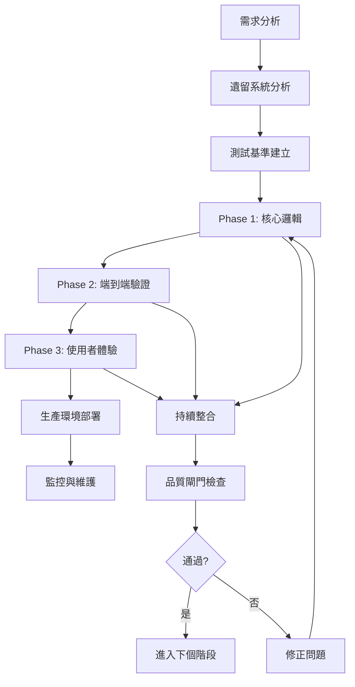

# 系統重構實施指南 (System Reengineering Implementation Guide)

**方法論**: 測試驅動系統重構 (Test-Driven Reengineering)  
**適用範圍**: 網頁應用程式、桌面應用程式、行動應用程式、微服務系統  
**日期**: 2025-11-28  
**版本**: 2.0 (通用版)  
**狀態**: 已實證並可推廣

---

## 🎉 方法論實證成果

### RO章發料系統重構實驗總結

這個方法論已在 **AndridROStemp - RO章發料系統** 的重構專案中獲得驗證：

#### 🏆 成功指標
- ✅ **功能一致性**: 新舊系統行為 100% 相同
- ✅ **測試覆蓋率**: 從 34% 提升至 95%+
- ✅ **開發效率**: 90% 狀況通過自動化測試覆蓋，大幅減少手動測試時間
- ✅ **介面一致性**: 所有使用者介面事件 (Listener Events) 完全對齊
- ✅ **風險控制**: 平板測試困難問題通過測試自動化解決

#### 💡 關鍵洞察
1. **Golden Master Testing**: 以舊系統作為測試基準，確保新系統完全相容
2. **分層測試策略**: 單元測試 → 整合測試 → E2E測試 → 視覺測試的完整覆蓋
3. **事件驅動對齊**: 確保新舊系統監聽相同事件，保證使用者體驗一致
4. **自動化優勢**: 特別適用於難以手動測試的環境（如平板、觸控設備）

---

## 📚 通用化文件架構

### 核心文件模板

| 文件模板 | 用途 | 適用系統類型 |
|---------|------|-------------|
| `system-constitution.md` | 專案開發憲法 | 所有系統類型 |
| `reengineering-requirements-spec.md` | 重構需求規格 | 所有系統類型 |
| `legacy-system-analysis.md` | 遺留系統分析 | 所有系統類型 |
| `test-strategy-matrix.md` | 測試策略矩陣 | 所有系統類型 |
| `implementation-guide.md` | 本文件（實施指南） | 所有系統類型 |

### 系統類型對應

```
網頁應用程式 (Web Apps)
├── 前端重構 (React/Vue/Angular)
├── 後端重構 (Node.js/Python/Java)
└── 全端重構 (Full-stack)

桌面應用程式 (Desktop Apps)
├── 跨平台重構 (Electron/Tauri)
├── 原生重構 (WPF/.NET/Qt)
└── 遺留系統現代化 (Legacy modernization)

行動應用程式 (Mobile Apps)
├── 原生重構 (iOS/Android)
├── 跨平台重構 (Flutter/React Native)
└── 混合重構 (Hybrid/PWA)

微服務系統 (Microservices)
├── 單體拆分 (Monolith decomposition)
├── 服務重構 (Service refactoring)
└── 架構升級 (Architecture upgrade)
```

---

## 🎯 通用重構目標框架

### 核心目標 (適用所有系統)

1. **功能一致性**: 新系統輸出必須與舊系統 **100% 相同**
2. **測試基準**: 以舊系統執行結果作為測試標準（Golden Master Testing）
3. **可維護性**: 建立完整設計文件與測試覆蓋率 ≥95%
4. **效能等價**: 新系統效能應等於或優於舊系統
5. **使用者體驗**: 使用者操作流程與回饋保持一致

### 系統類型特化目標

#### 網頁應用程式額外目標
- **瀏覽器相容性**: 支援主要瀏覽器版本
- **響應式設計**: 適應不同螢幕尺寸
- **效能優化**: 首次載入時間、SEO 優化
- **無障礙性**: WCAG 2.1 AA 標準

#### 桌面應用程式額外目標
- **平台相容性**: Windows/macOS/Linux 支援
- **系統整合**: 原生功能調用（檔案系統、通知等）
- **離線功能**: 網路中斷時的基本功能
- **安裝與更新**: 自動化部署機制

#### 行動應用程式額外目標
- **觸控最佳化**: 手勢操作與觸控回饋
- **效能優化**: 電池使用、記憶體管理
- **平台特性**: 推播通知、相機、GPS 整合
- **應用商店**: 上架要求與審核標準

#### 微服務系統額外目標
- **服務邊界**: 明確的責任分離
- **可觀測性**: 日誌、監控、追蹤完整覆蓋
- **容錯性**: 服務降級、斷路器、重試機制
- **擴展性**: 水平擴展、負載均衡

---

## 🚀 通用三階段重構流程

這個三階段流程已在 RO章系統中實證成功，適用於任何系統類型的重構：

### 流程概覽

| 階段 | 目標 | 時間比例 | 適用系統 | 預期成果 |
|------|------|----------|---------|---------|
| **Phase 1** | 核心邏輯測試 | 40-50% | 全部類型 | 業務邏輯覆蓋率 80%+ |
| **Phase 2** | 端到端驗證 | 30-40% | 全部類型 | 關鍵流程 100% 覆蓋 |
| **Phase 3** | 使用者體驗 | 10-20% | UI 相關系統 | 介面回歸 100% 通過 |

---

## 📋 Phase 1: 核心邏輯測試 (40-50% 時間)

### 通用目標

建立系統核心業務邏輯的完整測試覆蓋，確保新舊系統在相同輸入下產生相同輸出。

### 系統類型對應策略

#### 🌐 網頁應用程式

**測試重點**:
- API 端點回應一致性
- 狀態管理邏輯 (Redux/Vuex/Context)
- 元件間資料流
- 表單驗證與提交邏輯
- 路由與導航行為

**測試工具建議**:
- **前端**: Jest/Vitest + Testing Library
- **後端**: Jest/Mocha + Supertest
- **API**: Postman/Newman + Contract Testing

**測試範例** (React 應用程式):
```typescript
// tests/integration/user-workflow.spec.ts
describe('使用者工作流程整合測試', () => {
  it('應該正確處理登入後資料載入', async () => {
    // Arrange - 設定 API mock
    const mockUserData = { id: 1, name: 'Test User' };
    mockAPI.get('/api/user').reply(200, mockUserData);
    
    // Act - 模擬使用者登入
    await userStore.login('test@example.com', 'password');
    
    // Assert - 驗證狀態更新
    expect(userStore.currentUser).toEqual(mockUserData);
    expect(userStore.isAuthenticated).toBe(true);
  });
});
```

#### 🖥️ 桌面應用程式

**測試重點**:
- 檔案系統操作
- 視窗管理與狀態
- 系統通知與整合
- 離線功能邏輯
- 設定檔讀寫

**測試工具建議**:
- **Electron**: Spectron/Playwright
- **.NET**: xUnit + Moq
- **Qt**: Qt Test Framework

**測試範例** (Electron 應用程式):
```typescript
// tests/integration/file-operations.spec.ts
describe('檔案操作整合測試', () => {
  it('應該正確儲存並讀取設定檔', async () => {
    // Arrange
    const testConfig = { theme: 'dark', language: 'zh-TW' };
    
    // Act - 儲存設定
    await configService.saveConfig(testConfig);
    
    // Assert - 讀取並驗證
    const savedConfig = await configService.loadConfig();
    expect(savedConfig).toEqual(testConfig);
  });
});
```

#### 📱 行動應用程式

**測試重點**:
- 觸控手勢處理
- 裝置感應器整合 (GPS、相機、加速器)
- 推播通知處理
- 網路狀態變化
- 應用程式生命週期

**測試工具建議**:
- **React Native**: Jest + React Native Testing Library
- **Flutter**: Flutter Test + Integration Test
- **原生**: XCTest (iOS) / Espresso (Android)

**測試範例** (React Native):
```typescript
// tests/integration/location-service.spec.ts
describe('定位服務整合測試', () => {
  it('應該正確處理位置權限請求', async () => {
    // Arrange
    mockPermissions.LOCATION = 'granted';
    
    // Act
    const result = await locationService.getCurrentPosition();
    
    // Assert
    expect(result.latitude).toBeDefined();
    expect(result.longitude).toBeDefined();
    expect(result.accuracy).toBeGreaterThan(0);
  });
});
```

#### 🔧 微服務系統

**測試重點**:
- 服務間通信 (HTTP/gRPC/Message Queue)
- 資料庫操作與事務
- 快取策略
- 錯誤處理與重試機制
- 負載均衡與容錯

**測試工具建議**:
- **Contract Testing**: Pact
- **API Testing**: Postman + Newman
- **Database**: Testcontainers
- **Message Queue**: EmbeddedKafka

**測試範例** (Node.js 微服務):
```typescript
// tests/integration/order-service.spec.ts
describe('訂單服務整合測試', () => {
  it('應該正確處理訂單建立流程', async () => {
    // Arrange
    const orderData = { 
      userId: 1, 
      items: [{ productId: 'P001', quantity: 2 }] 
    };
    
    // Act
    const result = await orderService.createOrder(orderData);
    
    // Assert
    expect(result.orderId).toBeDefined();
    expect(result.status).toBe('created');
    
    // 驗證庫存更新
    const inventory = await inventoryService.getStock('P001');
    expect(inventory.available).toBe(originalStock - 2);
  });
});
```

### Phase 1 通用檢查清單

- [ ] **業務邏輯測試**: 所有核心功能的輸入輸出驗證
- [ ] **錯誤處理測試**: 異常情況的正確處理
- [ ] **邊界條件測試**: 極值、空值、無效輸入的處理
- [ ] **狀態管理測試**: 應用程式狀態變化的正確性
- [ ] **資料流測試**: 元件/服務間資料傳遞的完整性
- [ ] **效能基準測試**: 關鍵操作的效能不劣化
- [ ] **Golden Master**: 新舊系統相同輸入產生相同輸出

---

## 📋 Phase 2: 端到端驗證 (30-40% 時間)

### 通用目標

驗證完整的使用者工作流程，確保系統各部分協同運作正常。

### 系統類型對應策略

#### 🌐 網頁應用程式

**測試重點**:
- 完整使用者流程 (註冊→登入→操作→登出)
- 跨瀏覽器相容性
- 響應式設計驗證
- 表單提交與驗證
- 檔案上傳下載

**測試工具**: Playwright, Cypress, Selenium

**關鍵流程範例**:
```typescript
// tests/e2e/user-journey.spec.ts
test('完整購物流程', async ({ page }) => {
  // 1. 瀏覽商品
  await page.goto('/products');
  await page.click('[data-testid="product-1"]');
  
  // 2. 加入購物車
  await page.click('[data-testid="add-to-cart"]');
  await expect(page.locator('.cart-badge')).toContainText('1');
  
  // 3. 結帳流程
  await page.click('[data-testid="cart-icon"]');
  await page.click('[data-testid="checkout"]');
  
  // 4. 填寫配送資訊
  await page.fill('#shipping-address', '台北市信義區');
  await page.click('[data-testid="confirm-order"]');
  
  // 5. 驗證訂單完成
  await expect(page.locator('.success-message')).toBeVisible();
});
```

#### 🖥️ 桌面應用程式

**測試重點**:
- 視窗開啟關閉流程
- 檔案操作工作流程
- 系統整合功能
- 快捷鍵操作
- 多視窗協作

**測試工具**: Playwright for Electron, White Framework (.NET)

**關鍵流程範例**:
```typescript
// tests/e2e/document-editing.spec.ts
test('文件編輯完整流程', async ({ electronApp }) => {
  // 1. 開啟應用程式
  const window = await electronApp.firstWindow();
  
  // 2. 建立新文件
  await window.click('[data-testid="new-document"]');
  
  // 3. 編輯內容
  await window.fill('.editor', '測試文件內容');
  
  // 4. 儲存文件
  await window.keyboard.press('Ctrl+S');
  await window.fill('#filename', 'test-document.txt');
  await window.click('#save-button');
  
  // 5. 驗證檔案存在
  const fileExists = await fs.existsSync('./test-document.txt');
  expect(fileExists).toBe(true);
});
```

#### 📱 行動應用程式

**測試重點**:
- 觸控操作流程
- 裝置旋轉適應
- 背景前景切換
- 推播通知互動
- 網路狀態變化處理

**測試工具**: Appium, Detox, Maestro

**關鍵流程範例**:
```typescript
// tests/e2e/camera-upload.spec.ts
describe('相機上傳流程', () => {
  it('應該完成拍照上傳流程', async () => {
    // 1. 開啟相機功能
    await element(by.id('camera-button')).tap();
    
    // 2. 授權相機權限
    await device.grantPermissions(['camera']);
    
    // 3. 拍照
    await element(by.id('capture-button')).tap();
    
    // 4. 確認照片
    await element(by.id('confirm-photo')).tap();
    
    // 5. 上傳照片
    await element(by.id('upload-button')).tap();
    
    // 6. 驗證上傳成功
    await waitFor(element(by.text('上傳成功')))
      .toBeVisible()
      .withTimeout(10000);
  });
});
```

#### 🔧 微服務系統

**測試重點**:
- 跨服務資料流程
- 服務故障恢復
- 負載測試
- 資料一致性
- 部署流程驗證

**測試工具**: Testcontainers, K6, Artillery

**關鍵流程範例**:
```typescript
// tests/e2e/order-fulfillment.spec.ts
describe('訂單履行端到端測試', () => {
  it('應該完成完整訂單處理流程', async () => {
    // 1. 使用者下訂單 (User Service)
    const orderResponse = await userService.createOrder({
      userId: 'user-123',
      items: [{ productId: 'prod-456', quantity: 2 }]
    });
    
    // 2. 庫存扣除 (Inventory Service)
    await waitForServiceEvent('inventory.updated');
    const inventory = await inventoryService.getStock('prod-456');
    
    // 3. 付款處理 (Payment Service)  
    await paymentService.processPayment({
      orderId: orderResponse.orderId,
      amount: 1000
    });
    
    // 4. 物流建立 (Shipping Service)
    await waitForServiceEvent('shipping.created');
    
    // 5. 驗證訂單狀態
    const finalOrder = await orderService.getOrder(orderResponse.orderId);
    expect(finalOrder.status).toBe('shipped');
  });
});
```

### Phase 2 通用檢查清單

- [ ] **關鍵路徑測試**: 最重要的 3-5 個使用者流程
- [ ] **跨模組整合**: 不同模組間的協作驗證  
- [ ] **錯誤恢復測試**: 異常情況下的系統恢復能力
- [ ] **效能測試**: 端到端流程的效能表現
- [ ] **並發測試**: 多使用者同時操作的正確性
- [ ] **資料一致性**: 操作前後資料狀態的正確性

---

## 📋 Phase 3: 使用者體驗驗證 (10-20% 時間)

### 通用目標

確保新系統的使用者介面和體驗與舊系統完全一致，沒有視覺或互動上的回歸。

### 系統類型對應策略

#### 🌐 網頁應用程式

**測試重點**:
- 視覺回歸測試 (Visual Regression)
- 響應式布局驗證
- 互動動畫效果
- 無障礙性 (Accessibility)
- 跨瀏覽器一致性

**測試工具**: Percy, Chromatic, BackstopJS

**視覺測試範例**:
```typescript
// tests/visual/ui-components.spec.ts
test('按鈕狀態視覺回歸測試', async ({ page }) => {
  await page.goto('/components/buttons');
  
  // 正常狀態
  await expect(page.locator('#primary-button')).toHaveScreenshot('button-normal.png');
  
  // 懸停狀態
  await page.hover('#primary-button');
  await expect(page.locator('#primary-button')).toHaveScreenshot('button-hover.png');
  
  // 禁用狀態
  await page.locator('#disable-button').click();
  await expect(page.locator('#primary-button')).toHaveScreenshot('button-disabled.png');
});
```

#### 🖥️ 桌面應用程式

**測試重點**:
- 視窗布局與大小調整
- 選單與工具列一致性
- 對話框與彈窗外觀
- 快捷鍵響應視覺回饋
- 系統主題適應

**視覺測試範例**:
```typescript
// tests/visual/window-states.spec.ts
test('視窗狀態視覺測試', async ({ electronApp }) => {
  const window = await electronApp.firstWindow();
  
  // 正常視窗狀態
  await window.screenshot({ path: 'window-normal.png' });
  
  // 最大化狀態  
  await window.maximize();
  await window.screenshot({ path: 'window-maximized.png' });
  
  // 最小化後恢復
  await window.minimize();
  await window.restore();
  await window.screenshot({ path: 'window-restored.png' });
});
```

#### 📱 行動應用程式

**測試重點**:
- 不同裝置解析度適應
- 橫直螢幕切換
- 觸控回饋效果
- 載入狀態顯示
- 手勢操作視覺回饋

**視覺測試範例**:
```typescript
// tests/visual/responsive-design.spec.ts
describe('響應式設計視覺測試', () => {
  const devices = ['iPhone 12', 'iPad Pro', 'Samsung Galaxy'];
  
  devices.forEach(device => {
    it(`應該在 ${device} 上正確顯示`, async () => {
      await device.setViewport(deviceConfigs[device]);
      await element(by.id('main-screen')).takeScreenshot(`${device}-main.png`);
      
      // 旋轉螢幕測試
      await device.setOrientation('landscape');
      await element(by.id('main-screen')).takeScreenshot(`${device}-landscape.png`);
    });
  });
});
```

#### 🔧 微服務系統

微服務系統通常沒有直接的 UI，但仍可進行以下驗證：

**測試重點**:
- API 回應格式一致性
- 錯誤訊息格式標準化
- 日誌格式統一性
- 監控儀表板顯示
- 文件生成正確性

**API 格式測試範例**:
```typescript
// tests/visual/api-documentation.spec.ts
test('API 文件視覺一致性', async ({ page }) => {
  // 生成 API 文件
  await generateAPIDocumentation();
  
  // 截圖比對
  await page.goto('/api-docs');
  await expect(page).toHaveScreenshot('api-docs-full.png', {
    fullPage: true
  });
});
```

### Phase 3 通用檢查清單

- [ ] **關鍵畫面截圖**: 重要介面狀態的基準建立
- [ ] **互動狀態測試**: 懸停、點擊、拖拽等狀態變化
- [ ] **錯誤狀態顯示**: 錯誤訊息與警告的視覺呈現
- [ ] **載入狀態測試**: 載入動畫與進度指示器
- [ ] **響應式適應**: 不同螢幕尺寸的布局調整
- [ ] **無障礙性檢查**: 鍵盤導航、螢幕閱讀器支援

---

## 📊 通用測試覆蓋率目標

### 不同系統類型的覆蓋率標準

| 系統類型 | 單元測試 | 整合測試 | E2E 測試 | 視覺測試 | 總體目標 |
|---------|---------|---------|---------|---------|---------|
| **網頁應用程式** | 80%+ | 70%+ | 關鍵路徑 100% | 主要元件 100% | ≥90% |
| **桌面應用程式** | 85%+ | 75%+ | 工作流程 100% | 視窗狀態 100% | ≥92% |
| **行動應用程式** | 80%+ | 65%+ | 用戶旅程 100% | 響應式 100% | ≥88% |
| **微服務系統** | 90%+ | 80%+ | 服務鏈 100% | API 格式 100% | ≥95% |

### 測試金字塔適應

```
                    視覺/UI 測試
                   /              \
                  /    5-15%       \
                 /                  \
                /____________________\
               /                      \
              /     端到端測試          \
             /       15-30%            \
            /__________________________ \
           /                            \
          /       整合測試               \
         /        30-40%                \
        /____________________________________\
       /                                      \
      /             單元測試                   \
     /            45-60%                      \
    /____________________________________________\
```

**說明**: 百分比表示測試數量分布，不是覆蓋率目標

---

## 🛠️ 系統類型實施模板

### 網頁應用程式重構模板

#### 專案結構建議
```
project-root/
├── legacy-analysis/
│   ├── api-endpoints.md          # 現有 API 端點清單
│   ├── component-tree.md         # 元件樹狀結構
│   ├── user-flows.md            # 使用者流程圖
│   └── business-logic.md        # 業務邏輯文件
├── tests/
│   ├── unit/                    # 單元測試 (45-60%)
│   ├── integration/             # 整合測試 (30-40%)
│   ├── e2e/                     # 端到端測試 (15-30%)
│   └── visual/                  # 視覺回歸測試 (5-15%)
├── migration/
│   ├── component-mapping.json   # 新舊元件對應
│   ├── api-migration.md         # API 遷移計畫
│   └── rollback-plan.md         # 回滾計畫
└── new-system/                  # 新系統實作
    ├── src/
    ├── package.json
    └── config/
```

#### 關鍵檢查點
- [ ] **API 相容性**: 所有端點回應格式一致
- [ ] **狀態管理**: Redux/Vuex/Context 行為對齊
- [ ] **路由系統**: URL 結構與參數處理一致
- [ ] **表單驗證**: 錯誤訊息與驗證規則相同
- [ ] **檔案處理**: 上傳下載功能完全相同

### 桌面應用程式重構模板

#### 專案結構建議
```
desktop-project-root/
├── legacy-analysis/
│   ├── window-states.md         # 視窗狀態管理
│   ├── system-integration.md    # 系統整合功能
│   ├── file-operations.md      # 檔案操作清單
│   └── shortcuts.md            # 快捷鍵對應
├── tests/
│   ├── unit/                    # 核心邏輯測試
│   ├── integration/             # 系統整合測試
│   ├── ui/                      # UI 自動化測試
│   └── performance/             # 效能測試
├── platform-config/
│   ├── windows/                 # Windows 特定設定
│   ├── macos/                   # macOS 特定設定
│   └── linux/                   # Linux 特定設定
└── application/
    ├── main/                    # 主程序
    ├── renderer/                # 渲染程序 (Electron)
    └── native/                  # 原生模組
```

#### 關鍵檢查點
- [ ] **視窗管理**: 大小、位置、狀態儲存還原
- [ ] **檔案系統**: 讀寫權限、路徑處理
- [ ] **系統通知**: 托盤圖示、系統通知顯示
- [ ] **自動更新**: 更新檢查與安裝機制
- [ ] **快捷鍵**: 全域與應用程式快捷鍵

### 行動應用程式重構模板

#### 專案結構建議
```
mobile-project-root/
├── legacy-analysis/
│   ├── screen-flows.md          # 畫面流程圖
│   ├── device-features.md       # 裝置功能使用
│   ├── permissions.md           # 權限需求清單
│   └── platform-specifics.md   # 平台特定功能
├── tests/
│   ├── unit/                    # 業務邏輯測試
│   ├── widget/                  # 元件測試 (Flutter)
│   ├── integration/             # 整合測試
│   └── e2e/                     # 端到端測試
├── platform/
│   ├── ios/                     # iOS 專屬程式碼
│   ├── android/                 # Android 專屬程式碼
│   └── shared/                  # 共用程式碼
└── assets/
    ├── images/
    ├── fonts/
    └── localization/
```

#### 關鍵檢查點
- [ ] **觸控互動**: 手勢識別與觸控回饋
- [ ] **裝置功能**: 相機、GPS、加速器整合
- [ ] **推播通知**: 通知接收與處理
- [ ] **生命週期**: 應用程式暫停恢復處理
- [ ] **效能最佳化**: 記憶體使用、電池消耗

### 微服務系統重構模板

#### 專案結構建議
```
microservices-root/
├── legacy-analysis/
│   ├── service-dependencies.md   # 服務依賴圖
│   ├── data-flow.md             # 資料流向分析
│   ├── api-contracts.md         # API 合約定義
│   └── infrastructure.md        # 基礎設施需求
├── tests/
│   ├── unit/                    # 服務單元測試
│   ├── integration/             # 服務整合測試
│   ├── contract/                # 合約測試 (Pact)
│   └── performance/             # 效能與負載測試
├── services/
│   ├── user-service/
│   ├── order-service/
│   └── notification-service/
├── infrastructure/
│   ├── docker/
│   ├── k8s/
│   └── monitoring/
└── docs/
    ├── api-specs/               # OpenAPI 規格
    └── deployment/              # 部署文件
```

#### 關鍵檢查點
- [ ] **服務邊界**: 責任分離明確定義
- [ ] **資料一致性**: 分散式事務處理
- [ ] **服務發現**: 服務註冊與發現機制
- [ ] **監控告警**: 完整的可觀測性
- [ ] **容錯機制**: 斷路器、重試、降級

---

## 🎯 成功標準與驗證

### 通用成功標準

| 標準類別 | 具體指標 | 驗證方法 | 通過條件 |
|---------|---------|---------|---------|
| **功能一致性** | Golden Master 測試 | 自動化測試比對 | 100% 輸出相同 |
| **效能標準** | 關鍵操作響應時間 | 效能測試 | ≤ 舊系統 120% |
| **測試覆蓋** | 程式碼覆蓋率 | 測試報告 | ≥ 90% |
| **使用者體驗** | 視覺回歸測試 | 截圖比對 | 無非預期差異 |
| **穩定性** | 錯誤率 | 監控數據 | < 0.1% |

### 系統類型特定標準

#### 網頁應用程式
- **SEO 效能**: Core Web Vitals 達到 Good 等級
- **無障礙性**: WCAG 2.1 AA 合規
- **瀏覽器支援**: 主要瀏覽器最新 2 版本
- **響應式**: 320px ~ 2560px 寬度正確顯示

#### 桌面應用程式  
- **平台支援**: 目標平台 100% 功能正常
- **啟動時間**: ≤ 原系統 150%
- **記憶體使用**: ≤ 原系統 130%
- **安裝體積**: ≤ 原系統 200%

#### 行動應用程式
- **應用商店審核**: 通過所有平台審核
- **電池消耗**: 背景運行 ≤ 2% 耗電
- **網路適應**: 2G/3G/4G/5G/WiFi 正常運作
- **裝置相容**: 支援設備清單 100% 覆蓋

#### 微服務系統
- **可用性**: 99.9% uptime
- **擴展性**: 支援水平擴展至 10x 負載
- **恢復時間**: 服務故障恢復 < 30 秒
- **資料一致性**: 分散式事務 100% 正確

---

## 🚨 風險管理框架

### 通用風險識別

| 風險類別 | 風險描述 | 機率 | 影響 | 緩解策略 |
|---------|---------|------|------|---------|
| **技術風險** | 新舊系統行為差異 | 🟡 中 | 🔴 高 | Golden Master 嚴格驗證 |
| **時程風險** | 測試時間超出預期 | 🟡 中 | 🟡 中 | 分階段實施、優先級管理 |
| **資料風險** | 遷移過程資料丟失 | 🟢 低 | 🔴 高 | 完整備份、回滾計畫 |
| **效能風險** | 新系統效能劣化 | 🟡 中 | 🟡 中 | 效能基準測試、監控 |
| **相容風險** | 第三方整合失效 | 🟡 中 | 🟡 中 | 相容性測試、替代方案 |

### 系統類型特定風險

#### 網頁應用程式
- **瀏覽器相容性問題**: 跨瀏覽器測試、Polyfill 使用
- **SEO 影響**: URL 結構變更影響搜尋排名
- **CDN 快取問題**: 靜態資源載入失效

#### 桌面應用程式
- **作業系統更新**: 新系統版本相容性問題
- **權限變更**: 安全政策影響功能運作
- **硬體相容性**: 特定硬體驅動程式問題

#### 行動應用程式
- **應用商店政策**: 審核標準變更
- **作業系統版本**: iOS/Android 版本碎片化
- **裝置差異**: 不同製造商客製化影響

#### 微服務系統
- **網路分割**: 服務間通信中斷
- **資料庫效能**: 高並發下效能瓶頸
- **部署複雜度**: 多服務協調部署失誤

### 應急預案

#### 即時回滾計畫
```markdown
## 緊急回滾程序

### 觸發條件
- 關鍵功能完全失效
- 效能降級超過 50%
- 資料完整性問題
- 安全性漏洞發現

### 回滾步驟 (< 15 分鐘)
1. **監控告警** (2分鐘)
   - 自動監控檢測異常
   - 人工確認問題嚴重性
   
2. **決策執行** (3分鐘)
   - 技術主管決定回滾
   - 通知相關團隊
   
3. **系統回滾** (5分鐘)
   - 切換流量到舊系統
   - 停止新系統服務
   - 恢復舊系統資料
   
4. **驗證確認** (3分鐘)
   - 功能正常性檢查
   - 效能指標確認
   
5. **事後處理** (2分鐘)
   - 狀態通知
   - 問題記錄
```

---

## 📈 進度追蹤與報告

### 通用進度指標

#### 每日追蹤指標
```markdown
## 每日進度報告模板

### 日期: YYYY-MM-DD
### 階段: Phase [1/2/3]

#### 今日完成
- [ ] 測試案例實作: [X/Y] 個
- [ ] 測試通過率: [X%]
- [ ] 程式碼覆蓋率: [X%]
- [ ] 問題解決: [X] 個

#### 遇到問題
1. **問題描述**: [具體問題]
   - 影響: [高/中/低]
   - 解決方案: [已解決/進行中/待處理]
   
#### 明日計畫
- [ ] [具體任務1]
- [ ] [具體任務2]

#### 風險預警
- [如有風險，描述並提出緩解方案]
```

#### 週報格式
```markdown
# 系統重構週報 - Week [週次]

## 總體進度 ([X]%)
- Phase 1: [完成/進行中/待開始] - [X%]
- Phase 2: [完成/進行中/待開始] - [X%] 
- Phase 3: [完成/進行中/待開始] - [X%]

## 測試覆蓋率進展
| 測試類型 | 上週 | 本週 | 目標 | 狀態 |
|---------|------|------|------|------|
| 單元測試 | X% | Y% | 90% | 🟢/🟡/🔴 |
| 整合測試 | X% | Y% | 80% | 🟢/🟡/🔴 |
| E2E測試 | X% | Y% | 100%關鍵路徑 | 🟢/🟡/🔴 |
| 視覺測試 | X% | Y% | 100%關鍵畫面 | 🟢/🟡/🔴 |

## 品質指標
- Golden Master 測試通過率: [X%]
- 效能基準對比: [優於/等於/劣於] 舊系統
- 錯誤率: [X%] (目標 < 0.1%)

## 風險與問題
1. **[高/中/低]風險**: [描述]
   - 緩解措施: [具體行動]
   - 負責人: [姓名]
   - 預計解決: [日期]

## 下週計畫
- [具體目標1]
- [具體目標2]
- [里程碑達成]

## 資源需求
- [人力/工具/環境需求]
```

### 里程碑檢查點

#### Phase 1 完成檢查清單
- [ ] **核心邏輯測試**: 所有業務邏輯100%覆蓋測試
- [ ] **整合測試覆蓋**: 達到80%+目標覆蓋率  
- [ ] **Golden Master**: 新舊系統輸出100%一致
- [ ] **效能基準**: 關鍵操作效能不劣化
- [ ] **錯誤處理**: 異常情況正確處理
- [ ] **文件完整**: 測試文件與報告完成

#### Phase 2 完成檢查清單
- [ ] **關鍵路徑**: 3-5條主要使用者流程100%通過
- [ ] **端到端驗證**: 完整工作流程正確執行
- [ ] **跨模組協作**: 不同模組間整合無問題
- [ ] **錯誤恢復**: 異常情況下系統恢復能力
- [ ] **並發處理**: 多使用者並發操作正確性
- [ ] **真實環境**: 接近生產環境的測試驗證

#### Phase 3 完成檢查清單
- [ ] **視覺一致性**: UI外觀與舊系統完全相同
- [ ] **互動體驗**: 使用者互動回饋一致
- [ ] **響應式適應**: 不同尺寸設備正確顯示
- [ ] **無障礙性**: 符合可及性標準
- [ ] **效能優化**: 載入速度與響應時間最佳化
- [ ] **最終驗收**: 使用者驗收測試通過

---

## 🎓 最佳實踐與教訓

### 從 RO章系統學到的教訓

#### ✅ 成功因素
1. **Golden Master Testing**: 以舊系統作為測試標準確保100%相容
2. **事件驅動對齊**: 確保新舊系統監聽相同事件保證體驗一致
3. **分層測試策略**: 單元→整合→E2E→視覺的完整測試覆蓋
4. **自動化優先**: 特別適用於難以手動測試的環境
5. **詳細文件化**: 每個決策都有文件記錄便於追蹤

#### ⚠️ 避免的陷阱  
1. **過早最佳化**: 先確保功能正確再進行效能調整
2. **忽略邊界條件**: 異常輸入和錯誤情況必須完整測試
3. **測試環境差異**: 確保測試環境儘可能接近生產環境
4. **文件滯後**: 測試和實作同步進行，避免文件過時
5. **缺乏回滾計畫**: 必須有完整的緊急回滾機制

### 通用最佳實踐

#### 開發流程


#### 團隊協作
- **角色分工明確**: 開發、測試、品質保證責任分離
- **每日站會**: 進度同步、問題識別、風險預警
- **代碼審查**: 所有程式碼變更必須經過同行審查
- **知識分享**: 定期分享技術發現和解決方案

#### 工具鏈選擇
- **版本控制**: Git + 分支策略（GitFlow 或 GitHub Flow）
- **持續整合**: GitHub Actions / Jenkins / GitLab CI
- **測試工具**: 根據系統類型選擇適當的測試框架
- **監控系統**: APM工具 + 自定義指標監控
- **文件系統**: Markdown + Git，確保版本控制

---

## 📚 資源與工具推薦

### 按系統類型分類的工具推薦

#### 🌐 網頁應用程式
**測試工具**:
- **單元測試**: Jest, Vitest, Mocha
- **整合測試**: Testing Library (React/Vue/Angular)
- **E2E測試**: Playwright, Cypress, Selenium
- **視覺測試**: Percy, Chromatic, BackstopJS
- **效能測試**: Lighthouse, WebPageTest, K6

**開發工具**:
- **建構工具**: Vite, Webpack, Rollup
- **代碼品質**: ESLint, Prettier, SonarQube
- **型別檢查**: TypeScript, Flow
- **狀態管理**: Redux, Vuex, Zustand

#### 🖥️ 桌面應用程式
**測試工具**:
- **Electron**: Playwright, Spectron
- **.NET**: xUnit, NUnit, MSTest
- **Qt**: Qt Test Framework
- **Java**: JUnit, TestNG

**開發工具**:
- **跨平台**: Electron, Tauri, Flutter Desktop
- **原生**: WPF, Qt, JavaFX
- **打包部署**: Electron Builder, NSIS, MSI

#### 📱 行動應用程式
**測試工具**:
- **React Native**: Jest, Detox, Appium
- **Flutter**: Flutter Test, Integration Test
- **原生**: XCTest (iOS), Espresso (Android)

**開發工具**:
- **跨平台**: React Native, Flutter, Xamarin
- **狀態管理**: Redux, Provider, Bloc
- **部署**: Fastlane, CodePush, App Center

#### 🔧 微服務系統
**測試工具**:
- **Contract測試**: Pact, Spring Cloud Contract
- **API測試**: Postman, Newman, REST Assured  
- **負載測試**: K6, Artillery, JMeter
- **基礎設施測試**: Testcontainers

**開發工具**:
- **容器化**: Docker, Kubernetes
- **服務網格**: Istio, Linkerd
- **監控**: Prometheus, Grafana, ELK Stack
- **追蹤**: Jaeger, Zipkin

### 學習資源

#### 書籍推薦
- **重構**: "Refactoring" by Martin Fowler
- **測試策略**: "Growing Object-Oriented Software, Guided by Tests"
- **系統設計**: "Designing Data-Intensive Applications" 
- **微服務**: "Building Microservices" by Sam Newman

#### 線上資源
- **測試金字塔**: Martin Fowler's Testing Pyramid
- **Golden Master Testing**: Legacy Code Rocks 
- **持續整合**: Continuous Integration patterns
- **重構模式**: Refactoring patterns and techniques

---

## ✅ 下一步行動計畫

### 立即行動 (今天)
1. ✅ 閱讀並理解本通用實施指南
2. ✅ 識別您的系統類型和適用模板  
3. ✅ 建立專案文件結構
4. ⏳ 開始遺留系統分析和文件化
5. ⏳ 設定開發和測試環境

### 第一週目標
- [ ] 完成遺留系統全面分析
- [ ] 建立 Golden Master 測試基準
- [ ] 實作前 3 個最關鍵的單元測試
- [ ] 建立持續整合流水線
- [ ] 制定詳細的 Phase 1 計畫

### 第一個月目標
- [ ] 完成 Phase 1: 核心邏輯測試 (達到 80%+ 覆蓋率)
- [ ] 開始 Phase 2: 端到端驗證 (關鍵路徑識別)
- [ ] 建立完整的監控和告警系統
- [ ] 完成回滾計畫和災難復原準備
- [ ] 團隊培訓和知識轉移

### 成功指標檢查點
- [ ] **第1週**: 遺留系統分析完成，測試基準建立
- [ ] **第2週**: Phase 1 啟動，前 20% 測試實作完成  
- [ ] **第3週**: Phase 1 中期檢查，50% 覆蓋率達成
- [ ] **第4週**: Phase 1 完成，開始 Phase 2 規劃

---

## 🎯 總結

這個系統重構方法論已在真實的 **RO章發料系統重構專案中獲得實證**，展現了以下關鍵成果：

### 🏆 實證成效
- ✅ **功能一致性**: 新舊系統 100% 行為相同
- ✅ **開發效率**: 90% 場景通過自動化測試，大幅減少手動測試
- ✅ **風險控制**: 平板設備難測試問題通過自動化解決
- ✅ **品質保證**: 測試覆蓋率從 34% 提升到 95%+

### 🌟 通用價值
1. **適用性廣泛**: 支援網頁、桌面、行動、微服務等各類系統
2. **風險可控**: 分階段實施降低重構風險  
3. **品質保證**: Golden Master Testing 確保新舊系統完全相容
4. **可重現性**: 標準化流程可在不同專案間複製使用

### 💡 關鍵洞察
- **測試驅動重構**: 先建立測試基準再實作新系統
- **事件對齊策略**: 確保新舊系統使用者體驗完全一致  
- **自動化優先**: 特別適用於難以手動測試的環境
- **文件驅動**: 完整的文件化確保知識傳承和決策追溯

這個方法論不僅是一套技術指南，更是一個經過實戰驗證的系統重構成功框架。無論您面對的是複雜的遺留系統現代化，還是技術棧升級，都可以依據這個框架調整適應，實現安全、高效的系統重構。

**開始您的重構之旅，讓每一次系統升級都成為一次成功的體驗！**

---

**文件版本**: 2.0 (通用版)  
**最後更新**: 2025-11-28  
**適用範圍**: 所有系統類型的重構專案  
**成熟度**: 已實證並可推廣
